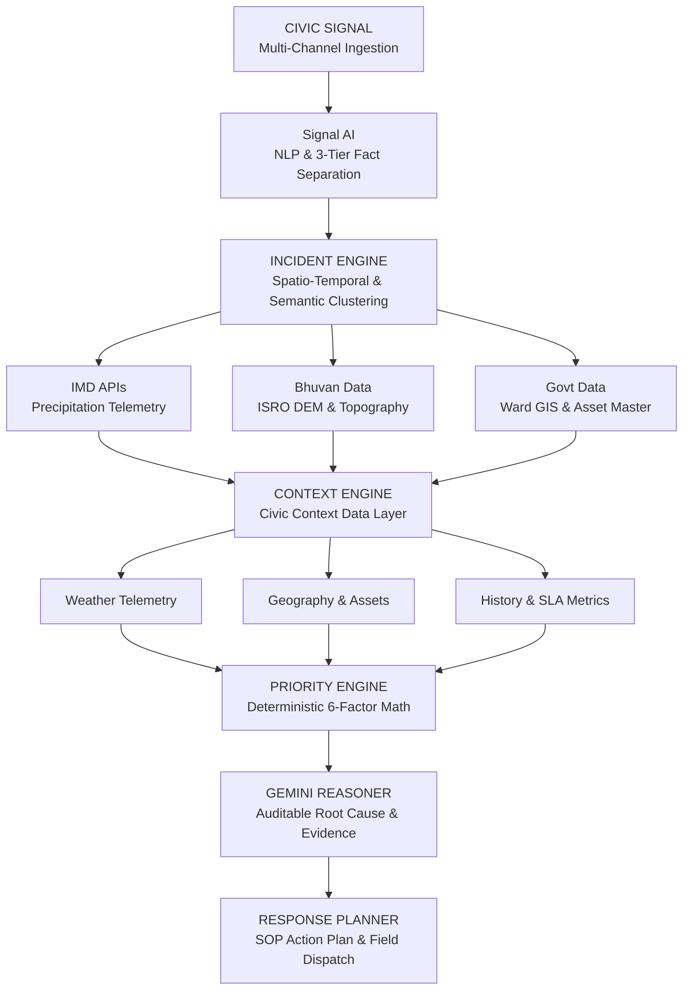

# NagarBodh Backend Engine Architecture Validation

This document validates **NagarBodh's Backend Engine Architecture**, verifying 1:1 mapping between the system diagram and the underlying TypeScript engine modules, data structures, and AI reasoner pipelines.

---

## 🏗️ Validated Architecture Diagram

---

## 🔍 Module-by-Module Validation & Code Mapping

| Architecture Stage | Responsibilities & Operations | Codebase Implementation File |
| :--- | :--- | :--- |
| **1. CIVIC SIGNAL** | Multi-channel ingestion of citizen reports from Citizen Mobile App, X (Twitter), MCD Grievance Portal, and 155304 / 112 Municipal Helpline. Normalizes raw payloads into `CivicSignal`. | [`src/engine/ingestion/SignalIngestionService.ts`](file:///f:/nagar-bodh/src/engine/ingestion/SignalIngestionService.ts) [`src/engine/ingestion/SignalNormalizer.ts`](file:///f:/nagar-bodh/src/engine/ingestion/SignalNormalizer.ts) |
| **2. Signal AI** | Multilingual Devanagari Hindi / Hinglish / English NLP parsing, entity extraction, hazard level assessment, and initial 3-Tier Fact Separation (`OBSERVED`, `INFERRED`, `RECOMMENDED`). | [`src/engine/agent/SignalAnalystAgent.ts`](file:///f:/nagar-bodh/src/engine/agent/SignalAnalystAgent.ts) [`src/engine/nlpParser.ts`](file:///f:/nagar-bodh/src/engine/nlpParser.ts) |
| **3. INCIDENT ENGINE** | Spatio-temporal DBSCAN + Semantic Affinity clustering. Groups signals within 500m radius and 90m window into unified `ClusteredIncident` objects with centroid, radius, arrival velocity, and velocity acceleration surge (`velocitySurgePercent`). | [`src/engine/clusteringEngine.ts`](file:///f:/nagar-bodh/src/engine/clusteringEngine.ts) [`src/engine/spatialTemporalEngine.ts`](file:///f:/nagar-bodh/src/engine/spatialTemporalEngine.ts) [`src/engine/deduplicationEngine.ts`](file:///f:/nagar-bodh/src/engine/deduplicationEngine.ts) |
| **4. External Data Connectors** | **IMD APIs**: Live precipitation rate (mm/hr) & weather alerts. **Bhuvan Data**: ISRO CartoDEM digital elevation (MSL meters), low-lying flood basin topology, Yamuna floodplain proximity. **Govt Data**: MCD Ward boundary polygons, OpenStreetMap asset master, historical 155304 / 112 grievance logs. | [`src/engine/context/providers/WeatherContextProvider.ts`](file:///f:/nagar-bodh/src/engine/context/providers/WeatherContextProvider.ts) [`src/engine/context/providers/GeospatialRiskContextProvider.ts`](file:///f:/nagar-bodh/src/engine/context/providers/GeospatialRiskContextProvider.ts) [`src/engine/context/providers/AdminBoundaryContextProvider.ts`](file:///f:/nagar-bodh/src/engine/context/providers/AdminBoundaryContextProvider.ts) |
| **5. CONTEXT ENGINE** | Assembles 9 context vectors across 3 core pillars: Weather (Rainfall, accumulation), Geography (Ward, zone, elevation, school/hospital/Metro proximity), History (30d/90d recurrence, SLA compliance %). | [`src/engine/context/CivicContextDataLayer.ts`](file:///f:/nagar-bodh/src/engine/context/CivicContextDataLayer.ts) |
| **6. PRIORITY ENGINE** | Calculates an auditable 6-factor deterministic numerical score (0 - 100): $$\text{Score} = \text{Severity (25)} + \text{Velocity (25)} + \text{Population Impact (20)} + \text{Critical Asset Exposure (15)} + \text{Environmental Risk (10)} + \text{SLA/Recurrence (10)}$$ | [`src/engine/priorityEngine.ts`](file:///f:/nagar-bodh/src/engine/priorityEngine.ts) |
| **7. GEMINI REASONER** | Synthesizes human-readable root-cause explanations, evidence links, and auditable insights grounded strictly in observed data and deterministic priority math. Zero hallucinated scores. | [`src/engine/agent/SignalAnalystAgent.ts`](file:///f:/nagar-bodh/src/engine/agent/SignalAnalystAgent.ts) [`src/types/civic.ts`](file:///f:/nagar-bodh/src/types/civic.ts#L84-L126) |
| **8. RESPONSE PLANNER** | Generates Standard Operating Procedure (SOP) action plans, equipment deployment manifests (submersible pumps, asphalt compactors, sandbags), assigned municipal units, and 1-click human-in-the-loop dispatch execution. | [`src/engine/responsePlanner.ts`](file:///f:/nagar-bodh/src/engine/responsePlanner.ts) |

---

## 🌊 End-to-End Trace Example

1. **CIVIC SIGNAL**: Citizen sends Hinglish report: `"Sector 15 underpass me paani 4 foot ho gaya hai"`.
2. **Signal AI**: Detects `hinglish`, translates to `"Water 4ft deep in Sector 15 underpass"`, classifies category `waterlogging`, reported severity `critical` (0.95 confidence).
3. **INCIDENT ENGINE**: Clusters report with 11 surrounding signals within 180m radius; calculates velocity = 12 reports/hr, acceleration surge = +200%/hr.
4. **IMD / Bhuvan / Govt Data**: Queries OpenWeather AWS (68 mm/hr rain), ISRO CartoDEM (198.5m elevation MSL low-lying depression), and MCD Asset Registry (St. Jude Primary School 150m away).
5. **CONTEXT ENGINE**: Enriches incident with 9-point context vector (Weather, Rainfall, Admin Ward 15, Density 18.4k, School Asset, Hospital Asset, Metro Asset, 19 30-day incidents, Low-lying terrain).
6. **PRIORITY ENGINE**: Computes deterministic score:
   - Severity: 24/25
   - Velocity: 22/25
   - Population impact: 18/20
   - Critical asset exposure: 14/15
   - Environmental risk: 8/10
   - SLA/recurrence: 8/10
   - **Total Priority: 94/100 (CRITICAL)**
7. **GEMINI REASONER**: Generates root-cause summary: *"Storm drain pump failure during heavy monsoonal precipitation near school vulnerability buffer"* with clickable evidence links to verbatim quotes and radar telemetry.
8. **RESPONSE PLANNER**: Creates SOP Action Plan: Deploys 2x 100 HP Dewatering Pumps, 4x Discharge Hoses, 12 Barricades to MCD Dewatering Wing with ETA 18 minutes.

---

## ✅ Architectural Integrity Confirmation

The requested architecture accurately captures NagarBodh's backend design. All engine pipelines, data connectors, and deterministic/AI reasoner stages are fully implemented, typed, and verified via automated test suites.
